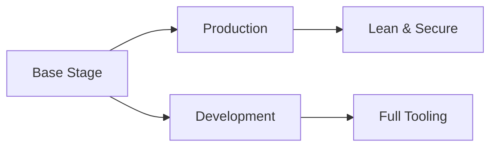

<div align="center">

# 🧟 FrankenPHP Docker Images

**Production-ready containers that don't suck.**

[](https://github.com/prvious/frankenphp)
[](https://www.php.net/)
[](LICENSE)

*FrankenPHP meets Laravel. HTTP/3 meets productivity. One image to rule them all.*

</div>

---

## ⚡ What's This?

Custom FrankenPHP images that combine the raw power of Caddy + PHP with everything you actually need: database drivers, Node.js tooling, image optimization, and developer happiness. 

**No bloat. No BS. Just working containers.**

Built on FrankenPHP (Caddy + PHP in one binary), these images give you HTTP/3, automatic HTTPS, and native PHP execution—then add batteries for Laravel, Symfony, and modern PHP apps.

## 🎯 Why Use This?

<table>
<tr>
<td width="33%" valign="top">

### 🚀 Production Ready
Multi-arch builds (AMD64/ARM64), optimized PHP config, health checks for zero-downtime deployments. Ships without dev tools—lean and mean.

</td>
<td width="33%" valign="top">

### 🛠️ Dev Optimized  
Xdebug ready, Zsh + Starship, modern CLI tools (gh, fzf, eza). Your local environment that actually feels good to use.

</td>
<td width="33%" valign="top">

### 📦 Full Stack
Node 24, pnpm, image optimization suite (jpegoptim, AVIF, FFmpeg), PostgreSQL 17 & MySQL clients. Everything in one image.

</td>
</tr>
</table>

## 📦 Available Images

> **All images:** Multi-arch (AMD64/ARM64) · Available on [GHCR](https://github.com/prvious/frankenphp/pkgs/container/frankenphp)

```bash
# Production Images (lean & optimized)
ghcr.io/prvious/frankenphp:latest          # PHP 8.4
ghcr.io/prvious/frankenphp:php8.4          # PHP 8.4
ghcr.io/prvious/frankenphp:php8.3          # PHP 8.3

# Development Images (Xdebug + dev tools)
ghcr.io/prvious/frankenphp:latest-dev      # PHP 8.4 + goodies
ghcr.io/prvious/frankenphp:php8.4-dev      # PHP 8.4 + goodies
ghcr.io/prvious/frankenphp:php8.3-dev      # PHP 8.3 + goodies
```

## 🚀 Quick Start

**Get up and running in 60 seconds or less.**

### Production Deployment

```dockerfile
FROM ghcr.io/prvious/frankenphp:php8.4

COPY . /app
RUN composer install --no-dev --optimize-autoloader \
    && pnpm install --prod && pnpm run build

EXPOSE 80
EXPOSE 443
CMD ["frankenphp", "run"]
```

### Local Development

```bash
# Pull and run
docker pull ghcr.io/prvious/frankenphp:php8.4-dev
docker run -it --rm -v $(pwd):/app -p 80:80 ghcr.io/prvious/frankenphp:php8.4-dev bash
```

### Docker Compose (Recommended)

```yaml
services:
  app:
    image: ghcr.io/prvious/frankenphp:php8.4-dev
    ports: ["80:80", "443:443"]
    volumes: [".:/app"]
    environment:
      SERVER_NAME: :80
      XDEBUG_MODE: debug
```

<details>
<summary>👉 Full Docker Compose Example</summary>

```yaml
version: '3.8'

services:
  app:
    image: ghcr.io/prvious/frankenphp:php8.4-dev
    ports:
      - "80:80"
      - "443:443"
    volumes:
      - .:/app
    environment:
      SERVER_NAME: :80
      XDEBUG_MODE: debug
      XDEBUG_CONFIG: client_host=host.docker.internal
    networks:
      - app-network

  database:
    image: postgres:17-alpine
    environment:
      POSTGRES_DB: app
      POSTGRES_USER: app
      POSTGRES_PASSWORD: secret
    volumes:
      - postgres-data:/var/lib/postgresql/data
    networks:
      - app-network

networks:
  app-network:
    driver: bridge

volumes:
  postgres-data:
```

</details>

## 🔋 What's Inside?

<details>
<summary><strong>📦 PHP Extensions</strong> (click to expand)</summary>

**Database:** mysqli · pdo_mysql · pgsql · pdo_pgsql · pdo_sqlsrv · sqlsrv  
**Images:** gd · imagick · exif  
**Core:** bcmath · intl · zip · xml · sockets · imap · ftp · pcntl  
**Dev Only:** xdebug (pre-configured)

</details>

<details>
<summary><strong>🛠️ Tools & Utilities</strong></summary>

**Package Managers:** Composer 2.x · pnpm · npm  
**Runtimes:** PHP 8.3/8.4 · Node 24  
**Database Clients:** PostgreSQL 17 · MySQL  
**Image Optimization:** jpegoptim · optipng · pngquant · gifsicle · avifenc · FFmpeg · svgo  
**Dev Tools (dev only):** GitHub CLI · eza · fzf · zoxide · htop · nano · Zsh + Zinit + Starship

</details>

<details>
<summary><strong>⚡ Laravel Aliases</strong></summary>

Pre-configured shell aliases to speed up your workflow:

```bash
pint          # ./vendor/bin/pint
pa            # php artisan
stan          # ./vendor/bin/phpstan
pest          # ./vendor/bin/pest
amf           # php artisan migrate:fresh
amfs          # php artisan migrate:fresh --seed
```

</details>

## 🏗️ Building Images Locally

**For contributors and the curious.**

```bash
# Build all variants (production + dev for all PHP versions)
docker buildx bake

# Build specific variant
docker buildx bake runner-php-8-4-bookworm-dev

# Build and push to registry
docker buildx bake --push

# Preview build configuration
docker buildx bake --print
```

**Build Matrix:** PHP 8.3/8.4 × Bookworm × Prod/Dev × AMD64/ARM64

## ⚙️ Configuration

### Key Environment Variables

```bash
SERVER_NAME=:80              # FrankenPHP server name
TZ=UTC                       # Timezone
XDEBUG_MODE=debug            # Xdebug mode (dev images)
PNPM_HOME=/usr/local/share/pnpm
```

### User Setup
Containers run as user `deploy` (UID: 1000, GID: 1000) for security. Customize with build args:
```dockerfile
ARG WWWUSER=1000
ARG WWWGROUP=1000
```

## 🧪 Testing

Validate your image has everything it needs:

```bash
# Test production image
docker run --rm ghcr.io/prvious/frankenphp:php8.4 php test.php production

# Test development image  
docker run --rm ghcr.io/prvious/frankenphp:php8.4-dev php test.php dev
```

The test script checks PHP extensions, CLI tools, and configuration.

## 🏛️ Architecture

**Multi-stage builds done right.**



**Base:** Common setup (extensions, system packages, user config)  
**Production:** Optimized php.ini, minimal Zsh, no dev tools  
**Development:** Xdebug, full Zsh setup, GitHub CLI, interactive tools

Multi-platform builds (AMD64/ARM64) run daily via GitHub Actions—auto-detecting new PHP releases.

## 🔒 Security

**Run safe. Sleep well.**

- ✅ Non-root user (`deploy`) for all processes
- ✅ `CAP_NET_BIND_SERVICE` for privileged ports (80/443) without root
- ✅ Production images exclude dev tools and Xdebug
- ✅ Proper permissions on `/app`, `/data/caddy`, `/config/caddy`

## ⚡ Performance

**Fast by default.**

- 🎯 **pnpm store** at `/home/deploy/.pnpm-store` for package sharing
- 🎯 **Layer caching** optimized (env files first, cleanup last)
- 🎯 **Multi-arch native builds** for Apple Silicon, AWS Graviton, ARM servers
- 🎯 **Plugin pre-downloading** during build time

## 🤝 Contributing

**We welcome contributions!**

### Code Style
- **HCL:** 4-space indentation, descriptive variables
- **Shell:** `set -exo pipefail`, proper quoting
- **Docker:** Multi-platform support, OCI labels
- **Docs:** Clear, professional, minimal emojis

### Process
1. Fork the repo
2. Create a feature branch
3. Test with `docker buildx bake`
4. Submit PR with clear description

---

<div align="center">

## 🔗 Related Projects

[**FrankenPHP**](https://frankenphp.dev/) · [**Caddy**](https://caddyserver.com/) · [**Laravel**](https://laravel.com/)

---

### 📝 License

Open source. Please refer to individual component licenses.

**Built with** FrankenPHP by Kévin Dunglas · Caddy · PHP Community

</div>
